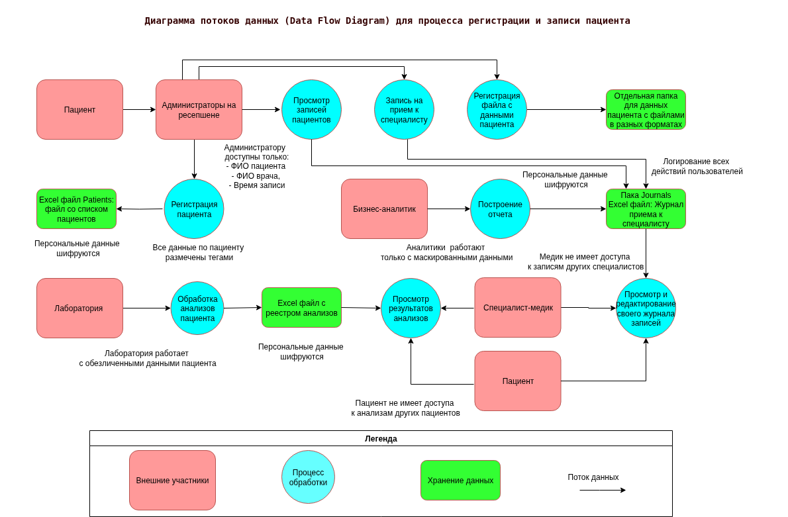
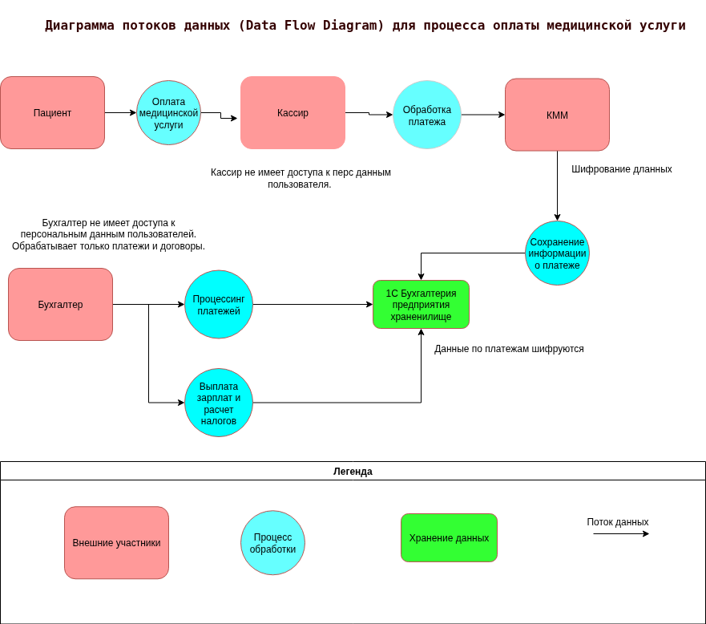

### Задание 1

* Диаграмма потоков данных (Data Flow Diagram) для процесса регистрации и записи пациента - 
* Диаграмма потоков данных (Data Flow Diagram) для процесса оплаты медицинской услуги - 

### Аудит существующих мер безопасности и проблемные зоны

1. ***Отсутствие строгого разграничения доступа.***
Отсутствуют механизмы разграничения доступа к данным пациентов среди сотрудников компании. Cотрудники могут редактировать/удалять данные любых пациентов. Высокий риск утечки и повреждений данных.
2. ***Хранение конфиденциальных данных в открытом виде.*** Данные хранятся в открытом виде (нет шифрования, маскирования, обфускации). В случае утечки все персональные данные (ФИО, адрес, дата рождения и так далее), пациентов будут доступны злоумышленникам. Сотрудники при составлении отчетов также работают с открытыми данными пациентов.
3. ***Отсутствие мониторинга и аудита событий.*** Все действия, совершаемые сотрудниками с данными компании никак не логируются и не мониторятся.
4. ***Отсутствие механизма "забвения".*** При обращении пациента в компанию с просьбой удалить все его персональные данные, то у компании нет такой функции, что является нарушением ФЗ-152.
5. ***Избыточность сбора персональных данных*** Пациенту предлагается заполнять расширенную форму с адресами учебы/работы, адреса прописки и эти данные не используются в основном функционале.
6. ***Отсутствие уведомление о сборе песональных данных.*** При заполнении форм, нет уведомления пользователю, как и кем будет использоваться эта информация в нарушение законодательства.
7. ***Необеспеченная передача и обмен данными.*** Внутренний обмен между компонентами выполняется без шифрования. 

### Список данных для защиты и способы защиты

1. ***Персональные данные пациентов.*** Шифрование в покое и при передаче, RBAC/ABAC, аудит доступа
2. ***Медицинские данные.*** Шифрование, обезличивание при аналитике, аудит, тегирование
3. ***Данные сотрудников.*** Шифрование, разграничение доступа, аудит
	
### Механизм тегирования данных

1. ***PII*** Персональные идентифицируемые данныe.Все поля с ФИО, телефоном, email, адресом
2. ***MED*** Медицинские данные.Диагнозы, анализы, медкарты
3. ***SENS*** Особо чувствительные данные. Хронические заболевания

