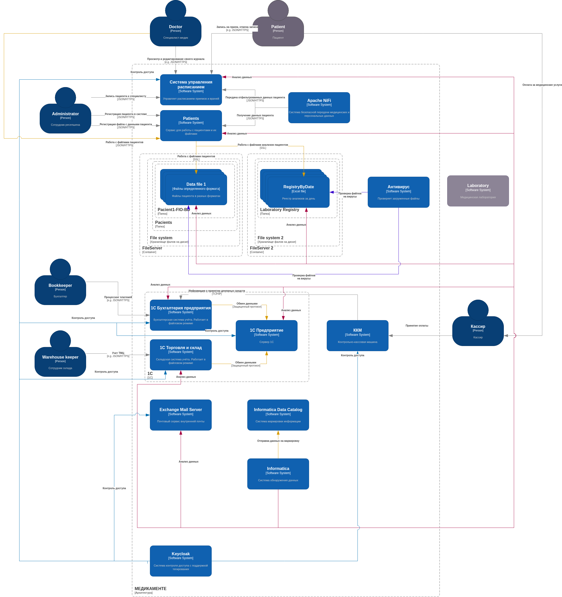

### Задание 2

Диаграмма контейнеров системы(целевая, срок 1 год) - 

### Описание целевой архитектуры
### Перефразированный текст:  

Система должна поддерживать работу в отказоустойчивом режиме (кластер). Для удобства управления данными и масштабируемости рекомендуется использовать микросервисную архитектуру, где каждый сервис отвечает за отдельный процесс.  

**Меры по обеспечению конфиденциальности:**  

1. **Журналирование и мониторинг:**  
   - Внедрить систему логирования событий, их отслеживания и реагирования на инциденты.  

2. **Контроль доступа к файловым хранилищам:**  
   - Ограничить доступ к файловым хранилищам, разрешив его только сетевому администратору под его учётной записью.  

3. **Настройка 1С:**  
   - Развернуть сервер 1С и перевести продукты с файлового на сетевой режим работы.  
   - Обеспечить доступ к 1С только через персональные учётные записи.  

4. **Интеграция Informatica:**  
   - Подключить Informatica с функцией машинного обучения ко всем источникам данных (почтовый сервер, файловые хранилища, БД).  
   - Внедрить систему тегирования данных через **Informatica Data Catalog**.  

5. **Авторизация и управление доступом:**  
   - Реализовать систему авторизации на основе тегов и ролей, интегрировав **Keycloak** с **Active Directory**.  

6. **Управление расписанием:**  
   - Разработать систему планирования для врачей, сотрудников ресепшена и пациентов.  
   - Для каждой группы пользователей выделить отдельные экземпляры приложения, чтобы минимизировать взаимное влияние.  

7. **Защита данных:**  
   - Все сетевые данные должны передаваться по криптостойким протоколам.  
   - Шифровать пользовательские файлы на уровне операционной системы.  
   - Зашифровать данные медицинских карт в БД (это может усложнить тегирование).  

8. **Контроль передачи данных:**  
   - Для защиты персональных данных при обмене между сервисами (например, расписания и пациентов) использовать **Apache NiFi**.  

9. **Управление пользовательскими данными:**  
   - Все данные, которые пользователь может удалить, должны храниться в зашифрованном виде, а ключи — в отдельных таблицах.  
   - При запросе на удаление ключ должен удаляться, что сделает данные недоступными.  
   - Пользователям можно предоставить возможность маркировать свои данные тегами, которые будут учитываться **Keycloak** (для контроля доступа) или **Apache NiFi** (для передачи данных).  
   - Данные должны маскироваться при обработке.  
