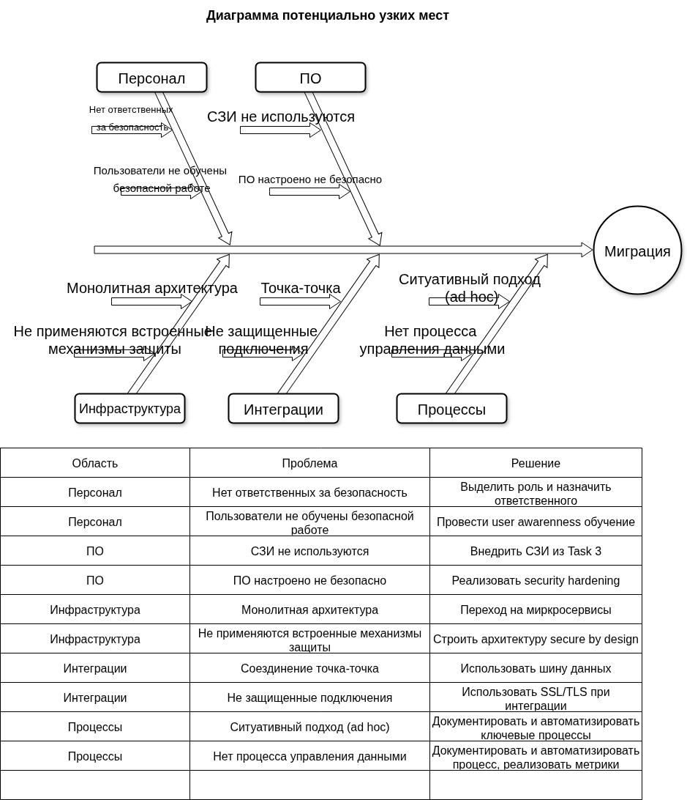

### Задание 4

### Оценка узких меcт при миграции

### **Отчет по анализу проблем безопасности и предложенным решениям**  

На основе диаграммы Ишикавы [Ishikawa](Ishikawa.drawio) выявлены ключевые проблемы в области информационной безопасности, сгруппированные по категориям: **Персонал, ПО, Инфраструктура, Интеграции, Процессы**. Для каждой проблемы предложены решения.  

---

### **1. Персонал**  

#### **Проблемы:**  
1. **Нет ответственных за безопасность**  
   - Отсутствие четкого распределения ролей и ответственности за ИБ.  
2. **Пользователи не обучены безопасной работе**  
   - Недостаточная осведомленность сотрудников о базовых принципах кибербезопасности.  

#### **Решения:**  
- Выделить роль **ответственного за ИБ** (CISO или Security Officer).  
- Провести **обучение пользователей (user awareness training)** по основам безопасности (фишинг, пароли, защита данных).  

---

### **2. Программное обеспечение (ПО)**  

#### **Проблемы:**  
1. **СЗИ (средства защиты информации) не используются**  
   - Отсутствие внедренных инструментов для защиты данных.  
2. **ПО настроено небезопасно**  
   - Несоответствие конфигураций стандартам безопасности (например, слабые пароли, открытые порты).  

#### **Решения:**  
- Внедрить **СЗИ** (например, DLP, антивирусы, SIEM).  
- Провести **security hardening** (усиление защиты настроек ПО и ОС).  

---

### **3. Инфраструктура**  

#### **Проблемы:**  
1. **Монолитная архитектура**  
   - Сложность масштабирования и изоляции уязвимостей.  
2. **Не применяются встроенные механизмы защиты**  
   - Игнорирование возможностей шифрования, разграничения доступа и аудита.  

#### **Решения:**  
- Перейти на **микросервисную архитектуру** для лучшей изоляции компонентов.  
- Реализовать **secure by design** (встроенная безопасность на этапе проектирования).  

---

### **4. Интеграции**  

#### **Проблемы:**  
1. **Соединения "точка-точка"**  
   - Сложность управления и контроля взаимодействий между системами.  
2. **Незащищенные подключения**  
   - Передача данных без шифрования (HTTP вместо HTTPS, отсутствие TLS).  

#### **Решения:**  
- Внедрить **шину данных (ESB, Kafka)** для централизованного управления интеграциями.  
- Использовать **SSL/TLS** для всех соединений.  

---

### **5. Процессы**  

#### **Проблемы:**  
1. **Ситуативный подход (ad hoc)**  
   - Отсутствие стандартизированных процедур, что приводит к ошибкам.  
2. **Нет процесса управления данными**  
   - Неясность в хранении, обработке и удалении информации.  

#### **Решения:**  
- **Документировать и автоматизировать ключевые процессы** (например, управление инцидентами).  
- Внедрить **метрики контроля** для оценки эффективности процессов.   

